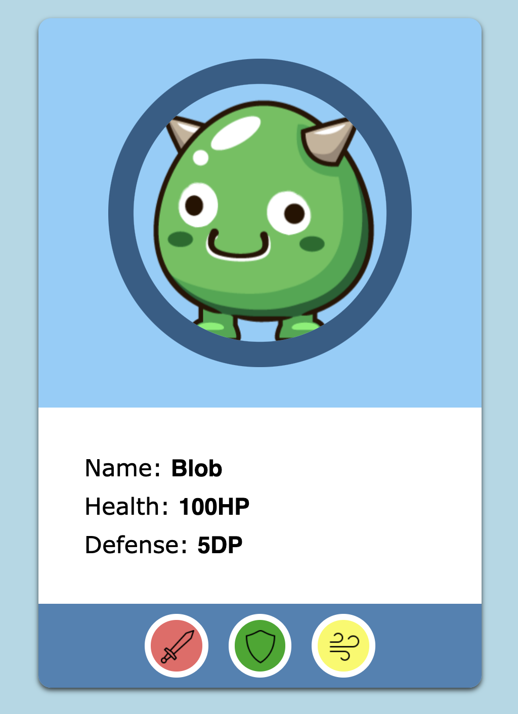
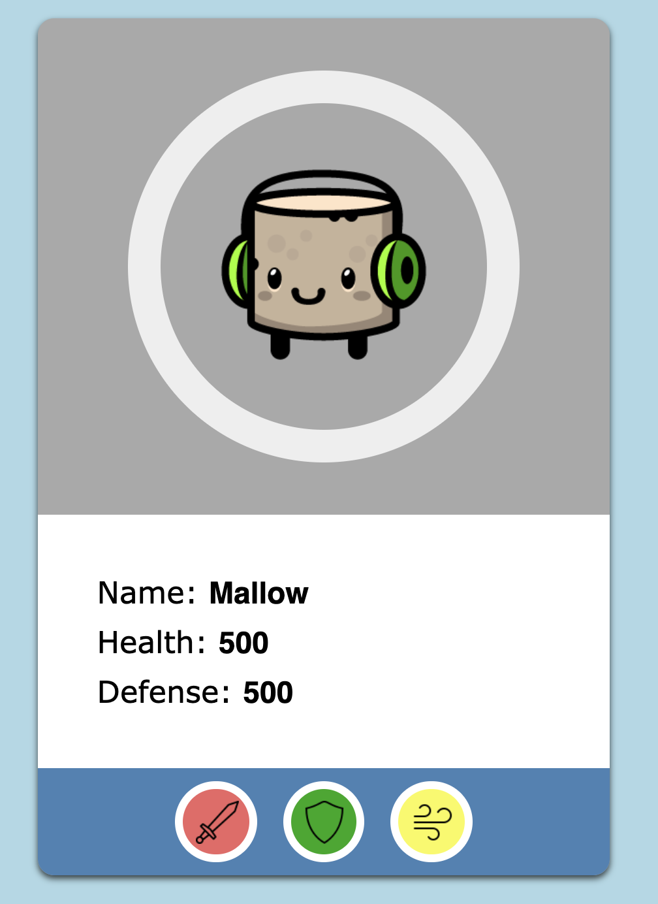
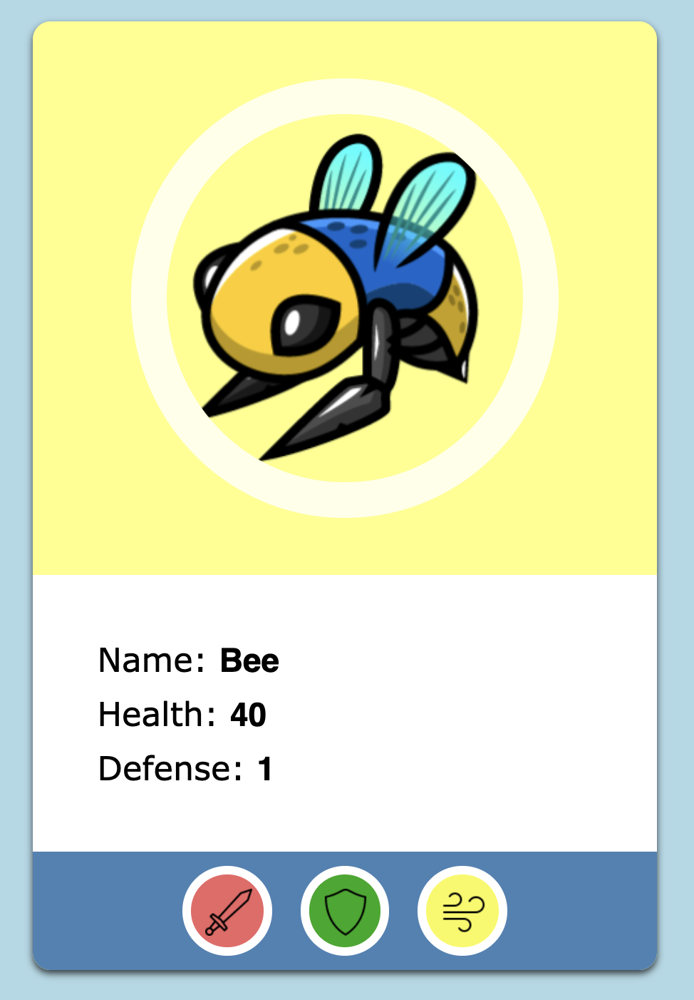

# Monster Generator
Skapa en webbplats som varje gång du laddar sidan visar en slumpad fiende.

Du behöver minst tre funktioner:
* En funktion som genererar en random fiende som ett objekt
* En funktion som skapar HTML-koden för en fiende
* En main-funktion som anropar båda dessa

## Tips
Två bra sätt att börja med såna här problem är att antingen börja i styling eller funktion.
Dvs, antingen får du all javascript att fungera först, sen sminkar.
Eller så gör du en statisk version först och sen lägger på javascript.

## Mocks

